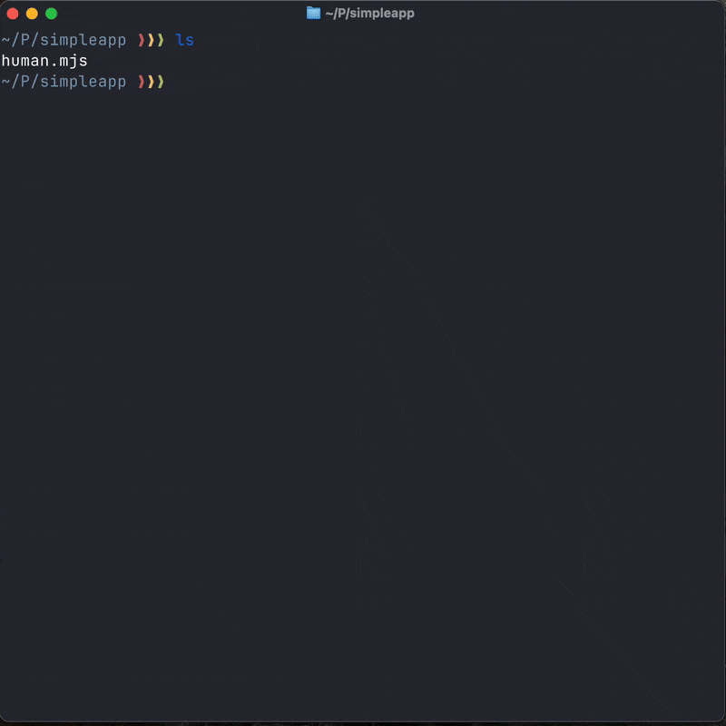

# umo

**Universal Modules** — Write once, import anywhere.
(A Claude Experiment)

<p align="center">
  
</p>

umo compiles packages from any language into universal WebAssembly modules that can be imported natively by any other language.

```
Python package  ──┐
                  │
Go module      ───┼──► WASM Component ──► Import from Node, Python, Go, Rust...
                  │
npm package    ───┘
```

## Why umo?

Each programming language ecosystem has many useful libraries. Umo makes them available to every language.

## Quick Start

### Install a Python package for use in Node.js

```bash
# Install the humanize package as a universal module
umo pip-install humanize

# That's it. Now use it in JavaScript:
```

```javascript
import { intcomma, naturalsize, ordinal } from './umo_modules/humanize/index.js';

console.log(intcomma(1000000));      // "1,000,000"
console.log(naturalsize(3000000));   // "3.0 MB"
console.log(ordinal(42));            // "42nd"
```

Full TypeScript support included — autocomplete, type checking, everything just works.

### Use Python classes with persistent state

**Python:**
```python
from redblacktree import rbtree

tree = rbtree()
tree.insert(5, 'five')
tree.insert(3, 'three')
tree.insert(7, 'seven')

print(tree.depth())           # 2
print(list(tree.inorder()))   # [(3, 'three'), (5, 'five'), (7, 'seven')]
```

**Node.js (same types, same API):**
```javascript
import { Rbtree } from './umo_modules/redblacktree/index.js';

const tree = new Rbtree([]);
tree.insert(5, 'five');
tree.insert(3, 'three');
tree.insert(7, 'seven');

console.log(tree.depth());     // 2
console.log(tree.inorder());   // [[3,"three"],[5,"five"],[7,"seven"]]
```

Types map directly: Python `int` → JS `number`, Python `list` → JS `array`. State persists across calls.

## Installation

```bash
npm install -g umo
```

### Prerequisites

umo requires these tools (installed automatically or via your package manager):

| Tool | Purpose | Install |
|------|---------|---------|
| Node.js 18+ | Runtime | [nodejs.org](https://nodejs.org) |
| Python 3.11+ | Python compilation | [python.org](https://python.org) |
| componentize-py | Python → WASM | `pip install componentize-py` |

## Commands

### `umo pip-install <package>`

Install a Python package as a universal module.

```bash
# Install latest version
umo pip-install humanize

# Install specific version
umo pip-install humanize@4.15.0
```

**Output:** Creates `umo_modules/<package>/` with:
- `index.js` — JavaScript bindings
- `index.d.ts` — TypeScript declarations
- `bindings/` — WASM component and runtime

### `umo pip-list`

List available curated packages.

```bash
umo pip-list
```

## How It Works

```
┌─────────────────┐
│  Python Package │
│   (humanize)    │
└────────┬────────┘
         │
         ▼
┌─────────────────┐
│ Type Extraction │  Analyzes signatures, docstrings, type hints
└────────┬────────┘
         │
         ▼
┌─────────────────┐
│ WIT Generation  │  Creates WebAssembly Interface Types
└────────┬────────┘
         │
         ▼
┌─────────────────┐
│  componentize   │  Compiles Python + CPython to WASM
└────────┬────────┘
         │
         ▼
┌─────────────────┐
│ jco transpile   │  Generates JS bindings from WASM
└────────┬────────┘
         │
         ▼
┌─────────────────┐
│  umo_modules/   │  Ready to import!
│   humanize/     │
└─────────────────┘
```

**Implementation:** umo uses the [WebAssembly Component Model](https://component-model.bytecodealliance.org/) to create portable, typed interfaces between languages. Functions calls cross the language boundary with native performance — no JSON serialization, no HTTP overhead.

## Supported Languages

### Source Languages (compile from)

| Language | Status | Command |
|----------|--------|---------|
| Python | **Stable** | `umo pip-install <pkg>` |
| TypeScript | Planned | `umo npm-install <pkg>` |
| Go | Planned | `umo go-install <pkg>` |
| Rust | Planned | `umo cargo-install <pkg>` |

### Target Languages (import into)

| Language | Status |
|----------|--------|
| JavaScript/TypeScript | **Stable** |
| Python | Planned |
| Go | Planned |
| Rust | Planned |

## Examples

### Number Formatting

```javascript
import {
  intcomma,
  intword,
  ordinal,
  apnumber,
  scientific,
  metric
} from './umo_modules/humanize/index.js';

intcomma(1234567);        // "1,234,567"
intword(1200000000);      // "1.2 billion"
ordinal(3);               // "3rd"
apnumber(5);              // "five"
scientific(0.00042, 2);   // "4.20 x 10⁻⁴"
metric(1500, "V", 3);     // "1.50 kV"
```

### File Sizes

```javascript
import { naturalsize } from './umo_modules/humanize/index.js';

naturalsize(300);          // "300 Bytes"
naturalsize(3000);         // "3.0 kB"
naturalsize(3000000);      // "3.0 MB"
naturalsize(3000000000);   // "3.0 GB"
```

### Data Structures

```javascript
import { Rbtree } from './umo_modules/redblacktree/index.js';

// Create a red-black tree (self-balancing BST)
const tree = new Rbtree([]);

// Stateful operations
tree.insert(10, 'ten');
tree.insert(5, 'five');
tree.insert(15, 'fifteen');

// Query - returns native JS types
console.log(tree.depth());     // 2 (number)
console.log(tree.inorder());   // [[5,"five"],[10,"ten"],[15,"fifteen"]]
```

### Data Science with Pandas

```javascript
import * as pd from './umo_modules/pandas/index.js';

// Create DataFrames
const df1 = await pd.DataFrame.create({ 'A': [1, 2], 'B': [3, 4] });
const df2 = await pd.DataFrame.create({ 'A': [5, 6], 'B': [7, 8] });

// Concatenate
const combined = await pd.concat([df1, df2]);

// Merge DataFrames
const left = await pd.DataFrame.create({ key: ['A', 'B'], val: [1, 2] });
const right = await pd.DataFrame.create({ key: ['A', 'C'], val: [3, 4] });
const merged = await pd.merge(left, right, 'inner', 'key');

// Check for missing values
console.log(await pd.isna(null));  // true
```

## Type Safety

umo generates full TypeScript declarations from Python type hints:

```typescript
// Auto-generated index.d.ts
export function intcomma(value: number, ndigits?: number): string;
export function naturalsize(value: number, binary?: boolean, gnu?: boolean): string;
export function ordinal(value: number): string;

export class Rbtree {
  constructor(initial: any[]);
  insert(key: number, value: string): void;
  remove(key: number): void;
  depth(): number;
  inorder(): Array<[number, string]>;
}
```

Your editor provides autocomplete, parameter hints, and type checking — just like native packages.

## Validated Packages

umo has been tested with 30+ Python packages across different categories. Here's a sample:

| Package | Category | Description |
|---------|----------|-------------|
| `pandas` | Data Science | DataFrames, data analysis (via Pyodide) |
| `networkx` | Data Science | Graph/network analysis (via Pyodide) |
| `sqlalchemy` | Database | SQL toolkit and ORM |
| `flask` | Web | Web microframework |
| `jinja2` | Templating | Template engine |
| `beautifulsoup4` | Parsing | HTML/XML parsing |
| `humanize` | Formatting | Human-readable numbers, dates, sizes |
| `click` | CLI | Command-line interface framework |
| `arrow` | Date/Time | Date and time handling |
| `redblacktree` | Data Structures | Self-balancing binary search tree |

**[View full list of validated packages](docs/validated-packages.md)** — includes 30+ packages across web, data, CLI, utilities, and more.

> **Note:** We validate that packages compile and run with basic tests. We don't maintain full test suite translations from the original Python packages.

## Limitations

### Current Limitations

- **Python stdlib:** Some stdlib modules aren't available in WASM (e.g., `_ssl`, `mmap`)
- **Native extensions:** Some packages with C/Rust extensions require Pyodide runtime (pandas, networkx, numpy work; requests, pydantic don't)
- **File I/O:** Limited filesystem access in WASM sandbox
- **Networking:** No direct network access from WASM

### Coming Later

- [ ] Go module compilation
- [ ] TypeScript/npm package compilation
- [ ] Import WASM modules into Python
- [ ] Import WASM modules into Go
- [ ] Browser support (run Python packages client-side)
- [ ] Package registry for pre-compiled modules

## Architecture

```
umo/
├── src/
│   ├── cli.ts                 # CLI entry point
│   ├── pip/
│   │   ├── package-resolver.ts    # pip package resolution
│   │   ├── type-extractor.ts      # Python type analysis
│   │   ├── wit-generator.ts       # WIT interface generation
│   │   ├── wasm-compiler.ts       # componentize-py integration
│   │   ├── js-generator.ts        # JavaScript binding generation
│   │   └── dts-generator.ts       # TypeScript declaration generation
│   ├── compiler/              # WASM compilation utilities
│   └── utils/                 # Shared utilities
├── umo_modules/               # Compiled universal modules
└── tests/                     # Test suite
```

## Development

```bash
# Clone and install
git clone https://github.com/AlaShiban/umo
cd umo
npm install

# Build
npm run build

# Run tests
npm test

# Development mode
npm run dev
```

## FAQ

**Q: How big are the compiled modules?**
A: Python modules include the CPython runtime (~30-50MB). This is cached and shared across modules.

**Q: Is it fast?**
A: Function calls have near-native overhead. The WASM boundary is much faster than HTTP/IPC. First load has a startup cost; subsequent calls are fast.

**Q: What about async/await?**
A: Async functions are supported in the Python source. The JS bindings are synchronous for now.

## License

MIT

## Credits

Built on the incredible work of:

- [WebAssembly Component Model](https://component-model.bytecodealliance.org/)
- [componentize-py](https://github.com/bytecodealliance/componentize-py)
- [jco](https://github.com/bytecodealliance/jco)
- [wasmtime](https://wasmtime.dev/)

---

<p align="center">
  <b>umo</b> — Universal Modules for a polyglot world
</p>
